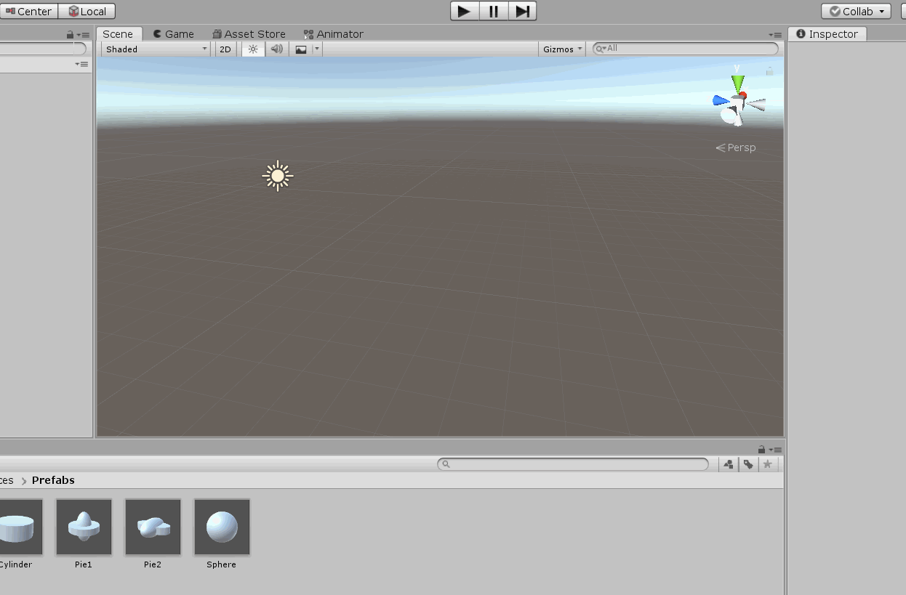
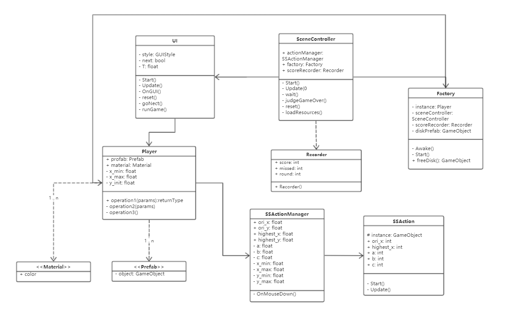
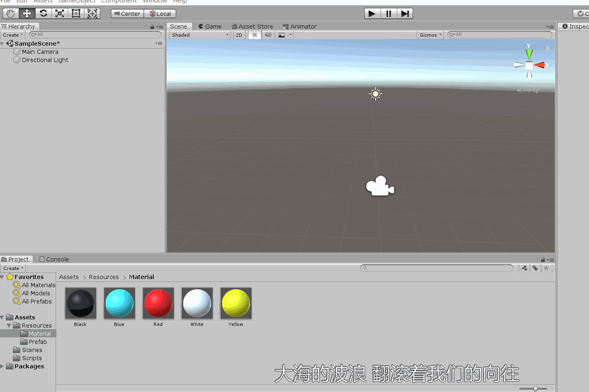

# 3D_HW6
| 姓名| 学号| 日期|
|:-:|:-:|:-:|
| 张浩轩| 17343149| 2019/10/15|

- [UFO改进版](#ufo) 
- [打靶游戏](#arrow)

<h2 id="ufo"> Hit UFO改进版 </h2>  

### 游戏的运行gif图如下:  
  
- 视频网站: [http://www.iqiyi.com/w_19sb7i6zpx.html](http://www.iqiyi.com/w_19sb7i6zpx.html)

### 改进飞碟（Hit UFO）游戏:  
- 游戏内容要求:  
    - 按 adapter模式 设计图修改飞碟游戏
    - 使它同时支持物理运动与运动学（变换）运动

UML图如下  
  
新增adapter模式, 使用工厂类Factory来控制UFO的生成和回收, 起到类似接口的作用, 同时在SSAction中增加了Rigidbody组件, 支持物理运动, 脚本代码如下:  
### UI.cs
```c#
using System.Collections;
using System.Collections.Generic;
using UnityEngine;

public class UI : MonoBehaviour
{
    private GUIStyle style;

    private bool next;

    private float T = 1.0f;

    // Start is called before the first frame update
    void Start()
    {
        next = true;
        style = new GUIStyle();
        style.fontSize = 40;
        InvokeRepeating("runGame", 0, T);
    }

    // Update is called once per frame
    void Update()
    {
        if (Recorder.score >= 20) {
            if (Recorder.round < 3 && next) {
                Invoke("reset", 3);
                CancelInvoke("runGame");
                Invoke("goNext", 3);
                next = false;
            } else CancelInvoke("runGame");
        } else next = true;
    }

    private void OnGUI() {
        GUI.Label(new Rect(Screen.width / 8, Screen.height / 6, 200, 100), "Round: " + Recorder.round + "\nScore: " + Recorder.score + "\nMissed: " + Recorder.missed, style);
        if(Recorder.round >= 3 && Recorder.score >= 20) {
            GUI.Label(new Rect(Screen.width / 2 - 100, Screen.height / 2 - 100, 200, 200), "You win!", style);
        }else if(Recorder.score >= 20) {
            GUI.Label(new Rect(Screen.width / 2 - 200, Screen.height / 2 - 100, 200, 200), "Next round will start after 3s", style);
        }
    }

    void reset() {
        Recorder.score = Recorder.missed = 0;
        Recorder.round += 1;
        T /= 2;
    }

    void goNext() {
        InvokeRepeating("runGame", 0, T);
    }

    void runGame() {
        Player mplayer = new Player();
        mplayer.createObject();
    }
}

```
### Recorder.cs
```c#
using System.Collections;
using System.Collections.Generic;
using UnityEngine;

public class Recorder
{
    public static int score;
    public static int missed;

    public static int round;

    public Recorder() {
        score = missed = 0;
        round = 1;
    }

}
```
### SceneController.cs
```c#
using System.Collections;
using System.Collections.Generic;
using UnityEngine;

public class SceneController : MonoBehaviour
{
    public SSAction actionManager { get; set; }
    public Factory factory { get; set; }
    public Recorder scoreRecorder { get; set; }
    public int round = 0;
    public string str;
    public int mtime = 0;
    public GameObject sth;

    void Start() {
        round = 1;
    }

    // Update is called once per frame
    void Update() {
        str = "Round:" + round.ToString();
        if (round == 4) {
            GameOver();
        }
    }
    public IEnumerator waitForOneSecond() 
    {
        while (mtime >= 0 && round == 3) {
            str = mtime.ToString(); 
            print("还剩" + mtime);
            yield return new WaitForSeconds(1);
            mtime--;
        }
        str = "";
        round = 1; 
    }
    public void GameOver() {
        str = "Game Over!!!";
    }
    public void StartGame()
    {
        if (round == 0) {
            round = 3;
            StartCoroutine(waitForOneSecond());
        }
    }
    public void ReStart()
    {
        round = 0;
    }
    public void hit()
    {
        if (round == 1) {
            Ray ray = Camera.main.ScreenPointToRay(Input.mousePosition);
            RaycastHit hit;
            if (Physics.Raycast(ray, out hit)) {
                if (hit.transform.tag == "Disk") {
                    sth.transform.position = hit.collider.gameObject.transform.position;
                    sth.GetComponent<Renderer>().material = hit.collider.gameObject.GetComponent<Renderer>().material;
                    sth.GetComponent<ParticleSystem>().Play();
                    hit.collider.gameObject.SetActive(false);
                }
            }
        }
    }
    public void LoadResources()  
    {
        sth = Instantiate(Resources.Load("prefabs/Explosion"), new Vector3(-40, 0, 0), Quaternion.identity) as GameObject;
        Instantiate(Resources.Load("prefabs/Light"));
    }
}
```
### Factory.cs
```c#
using System.Collections;
using System.Collections.Generic;
using UnityEngine;

public class Factory : MonoBehaviour
{
    private static Player _instance;
    public SceneController sceneControler { get; set; }
    public Recorder scoreRecorder;
    GameObject diskPrefab;
    public List<GameObject> used;
    public List<GameObject> free;

    private void Awake() {
        diskPrefab = Instantiate(Resources.Load<GameObject>("Prefabs/cube"), new Vector3(40, 0, 0), Quaternion.identity);
    }
    public void Start() {
        sceneControler.factory = this;
        scoreRecorder = sceneControler.scoreRecorder;
    }

    public void freeDisk(GameObject disk1)
    {
        for (int i = 0; i < used.Count; i++) {
            if (used[i] == disk1) {
                used.Remove(disk1);
                disk1.SetActive(true);
                free.Add(disk1);
            }
        }
        return;
    }
}
```
### Player.cs
```c#
using System.Collections;
using System.Collections.Generic;
using UnityEngine;

public class Player
{
    public GameObject cube;
    public GameObject cylinder;
    public GameObject sphere;
    public GameObject pie1;
    public GameObject pie2;

    public Material red;
    public Material green;
    public Material blue;

    /*
    public static int score;
    public static int missed;

    public static int round;
    */

    private const float x_min = 1;
    private const float x_max = 15 + 1;
    private const float y_init = -8;

    public Player() {
        red = Resources.Load<Material>("Materials/Red");
        green = Resources.Load<Material>("Materials/Green");
        blue = Resources.Load<Material>("Materials/Blue");
        cube = Resources.Load<GameObject>("Prefabs/Cube");
        cylinder = Resources.Load<GameObject>("Prefabs/Cylinder");
        sphere = Resources.Load<GameObject>("Prefabs/Sphere");
        pie1 = Resources.Load<GameObject>("Prefabs/Pie1");
        pie2 = Resources.Load<GameObject>("Prefabs/Pie2");
    }

    void changeColor(ref GameObject arg) {
        int color = Random.Range(0, 3);
        if (color == 0) arg.GetComponent<Renderer>().material = red;
        else if (color == 1) arg.GetComponent<Renderer>().material = green;
        else arg.GetComponent<Renderer>().material = blue;
    }

    float getPostionX() {
        float x = Random.Range(x_min, x_max);
        if (Random.Range(0, 2) == 0) return x;
        else return -x;
    }

    public void createObject() {
        GameObject sth;
        int c = Random.Range(0, 5);
        if (c == 0) sth = cube;
        else if (c == 1) sth = cylinder;
        else if (c == 2) sth = sphere;
        else if (c == 3) sth = pie1;
        else sth = pie2;
        sth.transform.position = new Vector3(getPostionX(), y_init, 0);
        changeColor(ref sth);
        sth = GameObject.Instantiate(sth);
        sth.AddComponent<SSActionManager>();
    }
}
```
### SSAction.cs
```c#
using System.Collections;
using System.Collections.Generic;
using UnityEngine;

public class SSAction : MonoBehaviour {
    protected static GameObject instance;
    public int ori_x;
    public int highest_x;
    public int a;
    public int b;
    public int c;


    // Start is called before the first frame update
    void Start()
    {
        
    }

    // Update is called once per frame
    void Update()
    {
        Vector3 pos = this.gameObject.transform.position;
        if (ori_x < highest_x) pos.x += Time.deltaTime;
        else pos.x -= Time.deltaTime;
        float x = pos.x;
        pos.y = a * Mathf.Pow(x, 2) + b * x + c;
        //Debug.Log("x: " + x + ", y: " + pos.y + ", ori_x: " + ori_x + ", ori_y: " + ori_y + ", h_x: " + highest_x + ", h_y: " + highest_y + ", a: " + a + ", b: " + b + ", c: " + c);
        this.gameObject.transform.position = pos;
        if (pos.y < -20) {
            Destroy(this.gameObject);
            Recorder.missed += 1;
        }
        if (Recorder.score >= 20) Destroy(this.gameObject);
    }
}
```
### SSActionManager.cs
```c#
using System.Collections;
using System.Collections.Generic;
using UnityEngine;

public class SSActionManager : MonoBehaviour
{
    public float ori_x;
    public float ori_y;
    public float highest_x;
    public float highest_y;

    private float a;
    private float b;
    private float c;

    private float x_min;
    private float x_max;
    private float y_min;
    private float y_max;

    // Start is called before the first frame update
    void Start()
    {
        x_min = 0;
        x_max = 10 + 1;
        y_min = 5;
        y_max = 20 + 1;
        ori_x = this.gameObject.transform.position.x;
        ori_y = this.gameObject.transform.position.y;
        highest_x = Random.Range(x_min, x_max);
        if (Random.Range(0, 2) == 0) highest_x = -highest_x;
        highest_y = Random.Range(y_min, y_max);
        while(Mathf.Abs(highest_x - ori_x) < 1) {
            highest_x = Random.Range(x_min, x_max);
        }

        float x2 = 2 * highest_x - ori_x, y2 = ori_y;
        float temp = (highest_y - y2) / (highest_x - x2);
        a = (ori_y - temp * ori_x - y2 + temp * x2) / (ori_x * ori_x - ori_x * (highest_x + x2) - x2 * x2 + x2 * (highest_x + x2));
        b = -2 * a * highest_x;
        c = y2 - a * (x2 * x2) - b * x2;
    }

    // Update is called once per frame
    void Update()
    {
        Vector3 pos = this.gameObject.transform.position;
        if (ori_x < highest_x) pos.x += Time.deltaTime;
        else pos.x -= Time.deltaTime;
        float x = pos.x;
        pos.y = a * Mathf.Pow(x, 2) + b * x + c;
        this.gameObject.transform.position = pos;
        if (pos.y < -20) {
            Destroy(this.gameObject);
            Recorder.missed += 1;
        }
        if (Recorder.score >= 20) Destroy(this.gameObject);
    }

    void OnMouseDown() {
        Destroy(this.gameObject);
        Recorder.score += 1;
    }
}
```

<h2 id="arrow"> 打靶游戏 </h2>

### 游戏的运行gif图如下:  


### 游戏内容要求：  
- 靶对象为 5 环，按环计分； 
- 箭对象，射中后要插在靶上  
- 增强要求：射中后，箭对象产生颤抖效果，到下一次射击 或 1秒以后  
- 游戏仅一轮，无限 trials；  
- 增强要求：添加一个风向和强度标志，提高难度  

具体代码在[Arrow_Asset/Scripts/](./Arrow_Asset/Scripts/)中, 如下:  
### UI.cs
```c#
using System.Collections;
using System.Collections.Generic;
using UnityEngine;

public class UI : MonoBehaviour
{
    private GUIStyle style;
    private Circle mcircle;

    // Start is called before the first frame update
    void Start()
    {
        style = new GUIStyle();
        style.fontSize = 40;
        style.normal.textColor = new Color(1, 1, 1, 1);
        mcircle = new Circle();
    }

    // Update is called once per frame
    void Update()
    {
        
    }

    void OnGUI() {
        GUI.Label(new Rect(20, 20, 200, 100), "Score: " + Recorder.score, style);

    }
}
```

### Circle.cs
```c#
using System.Collections;
using System.Collections.Generic;
using UnityEngine;

public class Circle
{
    private GameObject circle1;
    private GameObject circle2;
    private GameObject circle3;
    private GameObject circle4;
    private GameObject circle5;

    public Circle() {
        circle1 = Resources.Load<GameObject>("Prefab/Circle1");
        circle1 = GameObject.Instantiate(circle1);
        circle2 = Resources.Load<GameObject>("Prefab/Circle2");
        circle2 = GameObject.Instantiate(circle2);
        circle3 = Resources.Load<GameObject>("Prefab/Circle3");
        circle3 = GameObject.Instantiate(circle3);
        circle4 = Resources.Load<GameObject>("Prefab/Circle4");
        circle4 = GameObject.Instantiate(circle4);
        circle5 = Resources.Load<GameObject>("Prefab/Circle5");
        circle5 = GameObject.Instantiate(circle5);

        /*circle2.transform.parent = circle1.transform;
        circle3.transform.parent = circle1.transform;
        circle4.transform.parent = circle1.transform;
        circle5.transform.parent = circle1.transform;*/

        circle1.AddComponent<Score>();
        circle2.AddComponent<Score>();
        circle3.AddComponent<Score>();
        circle4.AddComponent<Score>();
        circle5.AddComponent<Score>();

        circle1.name = "1";
        circle2.name = "2";
        circle3.name = "3";
        circle4.name = "4";
        circle5.name = "5";
    }
}
```

### Score.cs
```c#
using System.Collections;
using System.Collections.Generic;
using UnityEngine;

public class Score : MonoBehaviour
{
    public int goal;

    // Start is called before the first frame update
    void Start()
    {
        goal = int.Parse(this.gameObject.name);
        Debug.Log("name: " + this.gameObject.name + ", goal: " + goal);
    }

    // Update is called once per frame
    void Update()
    {
        
    }

    void OnCollisionEnter(Collision collision) {
        Recorder.score += goal;
    }
}
```

### Recorder
```c#
using System.Collections;
using System.Collections.Generic;
using UnityEngine;

public class Recorder
{
    public static int score = 0;

}
```

### Model.cs
```c#
using System.Collections;
using System.Collections.Generic;
using UnityEngine;

public class Model : MonoBehaviour
{
    private GameObject sth;
    private int screen_width;
    private int screen_height;

    // Start is called before the first frame update
    void Start()
    {
        sth = Resources.Load<GameObject>("Prefab/Arrow");
        screen_width = Screen.width;
        screen_height = Screen.height;
    }

    // Update is called once per frame
    void Update()
    {
        if (Input.GetMouseButtonDown(0)) {
            Ray _ray = Camera.main.ScreenPointToRay(Input.mousePosition);
            RaycastHit _hit;
            Vector3 vec;
            if(Physics.Raycast(_ray, out _hit)) {
                vec = _hit.point;
                vec.z = Camera.main.transform.position.z + 1;
                sth.transform.position = vec;
                GameObject arrow = GameObject.Instantiate(sth);
                arrow.AddComponent<ModelController>();
                arrow.AddComponent<Rigidbody>();
            }
        }
    }
}
```

### ModelController.cs
```c#
using System.Collections;
using System.Collections.Generic;
using UnityEngine;

public class ModelController : MonoBehaviour
{
    private float speed;
    private bool fly;

    // Start is called before the first frame update
    void Start()
    {
        fly = true;
        speed = 20.0f;
    }

    // Update is called once per frame
    void Update()
    {
        if (this.gameObject.transform.position.y < -5) {
            Destroy(this.gameObject);
        }
        if (fly) {
            Vector3 vec = this.gameObject.transform.position;
            vec.z -= -speed * Time.deltaTime;
            this.gameObject.transform.position = vec;
        }
    }

    void OnCollisionEnter(Collision collision) {
        fly = false;
        Destroy(GetComponent<Rigidbody>());
        Destroy(GetComponent<Collider>());
    }
}
```


